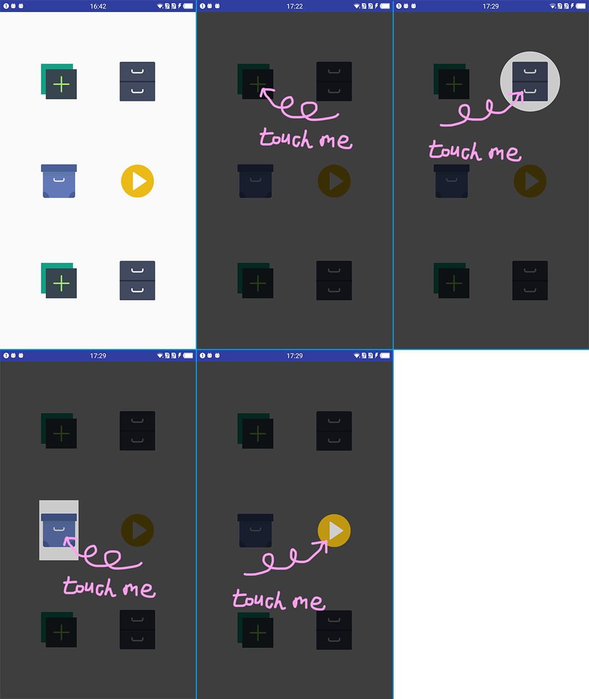

# Android UserGuide

[[English README](README.md)] [[中文说明](README_CN.md)]

Android User Guide 是一个用于为安卓应用构建用户向导(帮助教程)的框架。

Under [MIT LICENSE](LICENSE.md)

author: xiaozhuai - [xiaozhuai7@gmail.com](xiaozhuai7@gmail.com)

# Demo

这里有一个简单的例子

```java
public class MainActivity extends AppCompatActivity {

    private UserGuide mUserGuide;

    @Override
    protected void onCreate(Bundle savedInstanceState) {
        super.onCreate(savedInstanceState);
        setContentView(R.layout.activity_main);

        mUserGuide = new UserGuide(this, (FrameLayout) findViewById(R.id.user_guide_frame));
        mUserGuide.setUserGuideListener(mUserGuideListener);

        float density = getResources().getDisplayMetrics().density;

        mUserGuide.add(
                GuideBinder.build()
                        .bind(findViewById(R.id.btn_1))
                        .img(R.drawable.touch_me_1)
                        .size(300*density, 300*density)
                        .shadowType(GuideBinder.SHADOW_TYPE_FULL)
        );
        mUserGuide.add(
                GuideBinder.build()
                        .bind(findViewById(R.id.btn_2))
                        .shadowType(GuideBinder.SHADOW_TYPE_CIRCLE)
        );
        mUserGuide.add(
                GuideBinder.build()
                        .bind(findViewById(R.id.btn_3))
                        .shadowType(GuideBinder.SHADOW_TYPE_RECT)
        );
        mUserGuide.add(
                GuideBinder.build()
                        .bind(findViewById(R.id.btn_4))
                        .shadowType(GuideBinder.SHADOW_TYPE_FANTASY)
        );

        mUserGuide.next();

    }

    private UserGuide.UserGuideListener mUserGuideListener = new UserGuide.UserGuideListener() {
        @Override
        public void onStep(int step) {
            Toast.makeText(MainActivity.this, "on step "+step, Toast.LENGTH_SHORT).show();
        }

        @Override
        public void onBoundViewTouched(View v, PointF begin, PointF end) {
            Toast.makeText(MainActivity.this, "bound view touched", Toast.LENGTH_SHORT).show();
            mUserGuide.next();
        }

        @Override
        public void onEnd() {
            Toast.makeText(MainActivity.this, "guide end", Toast.LENGTH_SHORT).show();
        }

        @Override
        public void onBackgroundTouched() {
            Toast.makeText(MainActivity.this, "background touched", Toast.LENGTH_SHORT).show();
        }
    };
}

```

# Imgs



# Finally

原谅我的ps技术。我是说那个红色的箭头。 : )